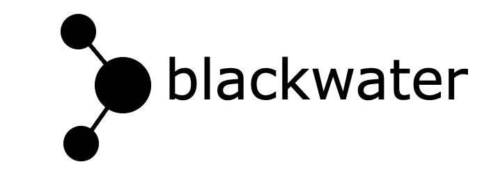

# Blackwater

Package for solving quantum computing problems using machine learning.

### Table of Contents

##### For Users

1.  [Installation](./docs/installation_guide.md)
2.  [Tutorials](./docs/tutorials)
3.  [How to Give Feedback](#how-to-give-feedback)
4.  [Contribution Guidelines](#contribution-guidelines)
5.  [References and Acknowledgements](#references-and-acknowledgements)
6.  [License](#license)

----------------------------------------------------------------------------------------------------

### How to Give Feedback

We encourage your feedback! You can share your thoughts with us by:
- [Opening an issue](https://github.com/IceKhan13/blackwater/issues) in the repository

----------------------------------------------------------------------------------------------------

### Contribution Guidelines

For information on how to contribute to this project, please take a look at our [contribution guidelines](./CONTRIBUTING.md).

----------------------------------------------------------------------------------------------------

## References and Acknowledgements
[1] Qiskit https://qiskit.org/ \
[2] Qiskit-terra https://github.com/Qiskit/qiskit-terra \
[3] PyTorch https://pytorch.org/ \
[4] PyTorch geometric https://pytorch-geometric.readthedocs.io/en/latest/ \
[5] [Zlatko Minev](https://github.com/zlatko-minev) for :water_polo: :ocean:

----------------------------------------------------------------------------------------------------

### License
[Apache License 2.0](./LICENSE)
